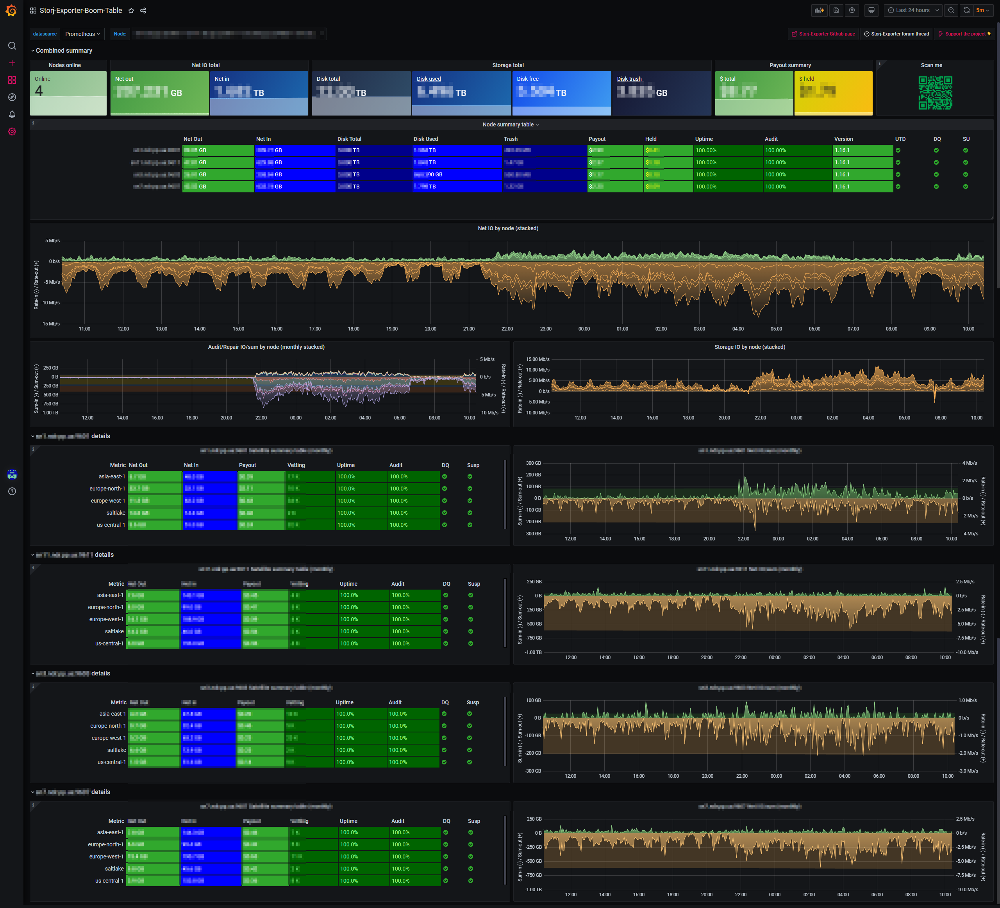

# Storj Exporter dashboard
 
Storj-exporter Grafana dashboard to visualise [Storj-Exporter](https://github.com/anclrii/Storj-Exporter) metrics for multiple Storj storage nodes.

## Support
 

Feel free to raise issues if you find them and also raise a PR if you'd like to contribute.

If you wish to support my work :coffee:, please find my eth wallet address below or scan the qr code:

`0x187C8C43890fe4C91aFabbC62128D383A90548Dd`

## Installation
Import Storj-Exporter-Boom-Table.json via your Grafana UI ("+" -> Import), select your prometheus datasorce at the top-left of the dashboard
